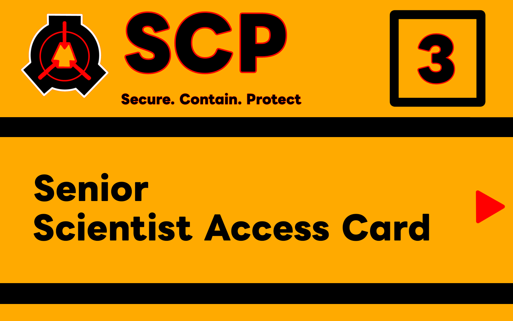
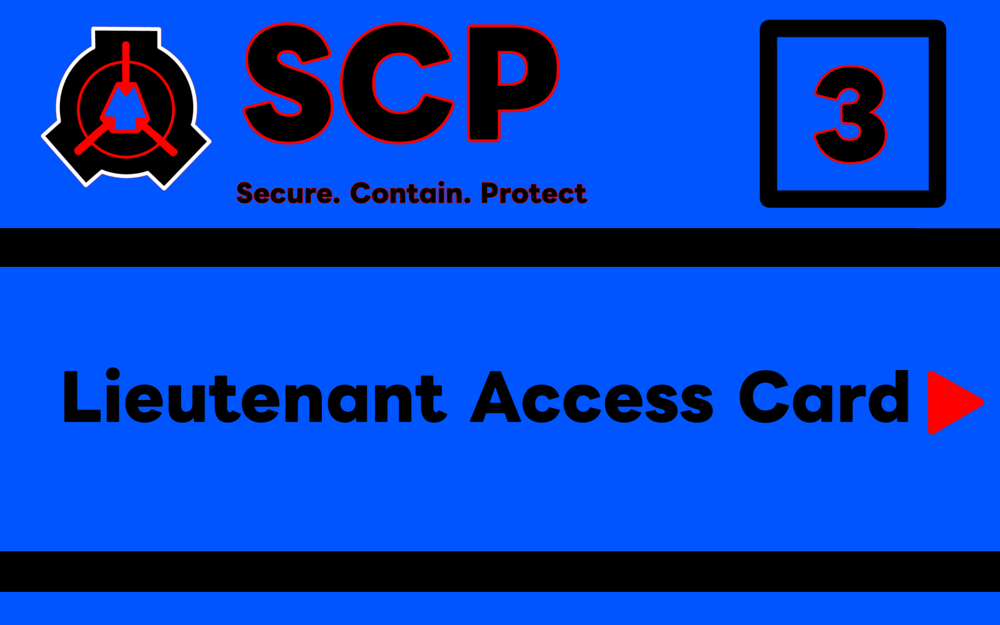
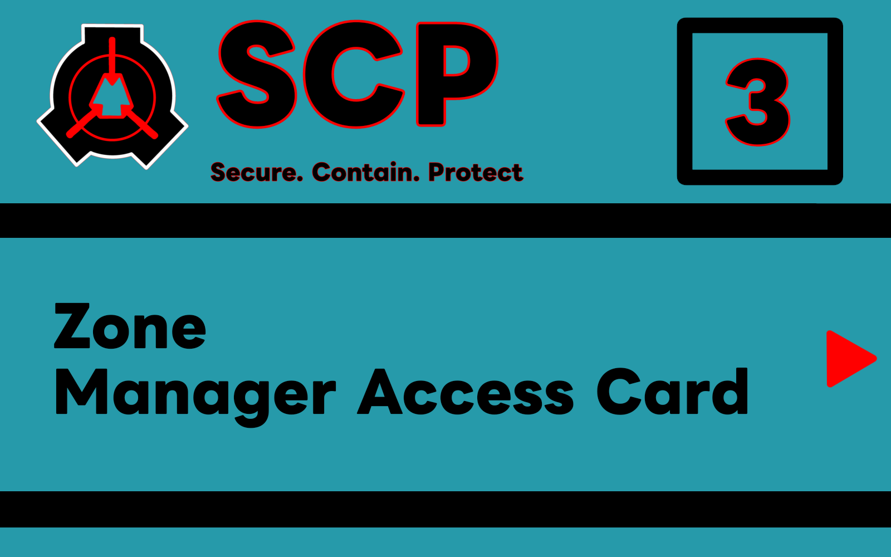
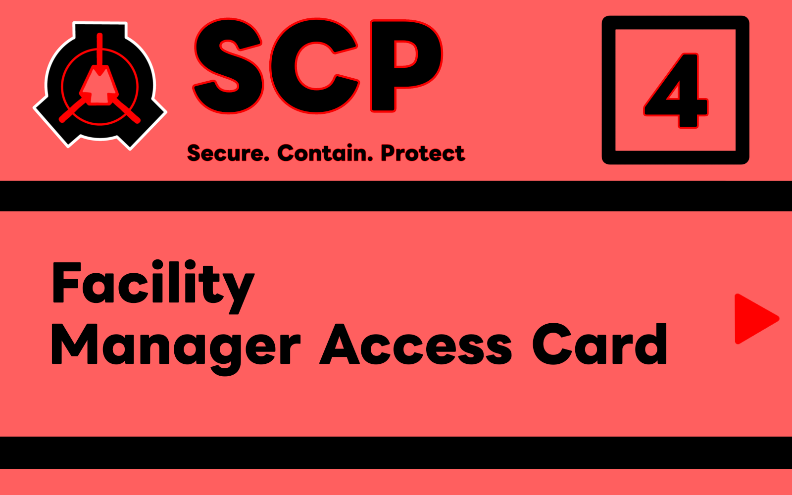
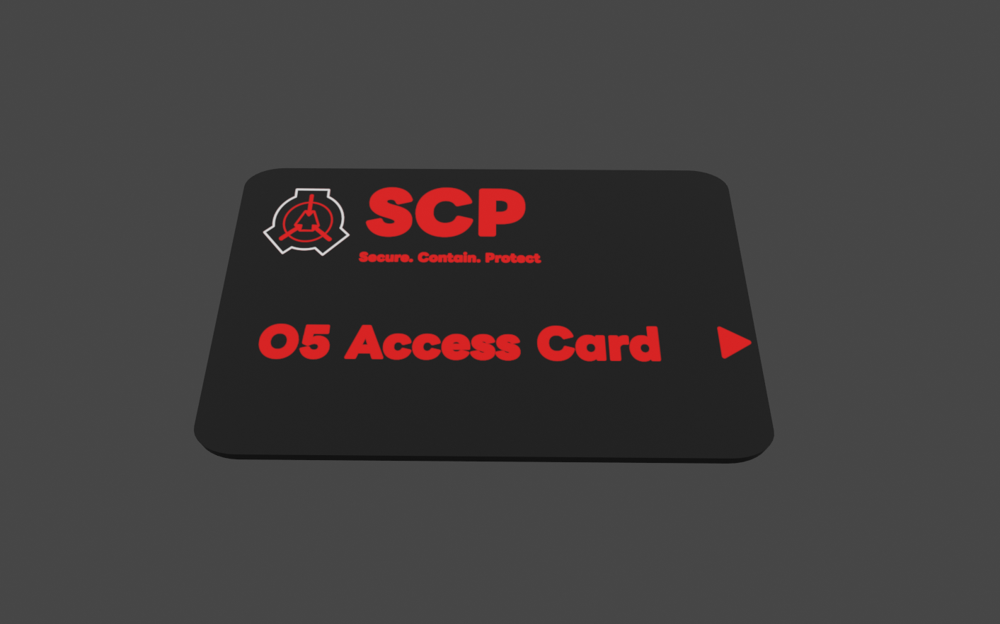
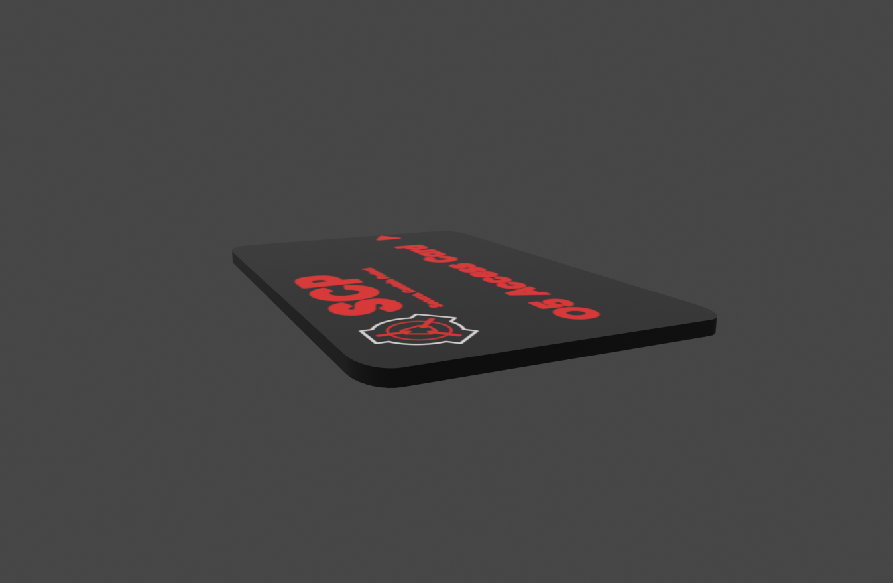

# Уровни доступа и карты

| Уровень | Доступ | Карты | Текстура карты |
|---------|--------|-------|----------------|
| 1 | SCP-914  SCP-330 | - Карта уборщика (сиреневая)  - Карта стажёра (серая) |    |
| 2 | В зависимости от типа карты:  - Оружейные во входной зоне и на 1 уровне содержания  - Некоторые SCP-объекты | - Карта научного сотрудника  - Карта охранника |    |
| 3 | В зависимости от типа карты:  - Оружейные на 2 уровне содержания  - Большинство SCP-объектов (за исключением отдельных евклидов/кетеров) | - Карта научного руководителя  - Карта сержанта МОГ  - Карта лейтенанта МОГ  - Карта менеджера зоны |        |
| 4 | В зависимости от типа карты:  - Все оружейные  - Все SCP-объекты | - Карта капитана МОГ  - Карта менеджера комплекса  - Устройство Повстанцев Хаоса |      |
| 5 | Полный доступ | - Карта совета O5 |  |

### Шаблон модели карт (cards/Blender/cards.blend)

<table>
  <tr>
    <td align="center">
      
    </td>
    <td align="center">
      
    </td>
  </tr>
</table>

**Размеры модели карты:**

➖ Длина - 176 мм
➖ Ширина - 110 мм
➖ Толщина - 4.7 мм

[⬆️ Назад к README.md](README.md)
