<h1 align="center" style="font-size: 3.5em; margin-bottom: 30px;">
  SCP: GAME UNITY
</h1>

# Телеграм канал, иконки

❗️ Первые версии иконок для данного информационного [Telegram-канала](https://t.me/+z-FTyLS0bs41NzFi), а также для самой игры находятся в папке icons

➖ Иконки представляют из себя частично изменённый логотип с официального сайта [SCP Foundation](http://scpfoundation.net/)

<table>
  <tr>
    <td align="center">
      
       
      <em>Иконка игры</em>
    </td>
    <td align="center">
      
       
      <em>Иконка TG</em>
    </td>
    <td align="center">
      
       
      <em>Оригинальная иконка SCP</em>
    </td>
  </tr>
</table>

# Всё об идее игры:

## 1) Зоны содержания:

➖ **Поверхность** (входы, зона выхода, лифты)

➖ **Входная зона** (офисы, входные шлюзы, комнаты персонала, столовые, комнаты отдыха и т.д.)

➖ **1 уровень** - содержание безопасных объектов и некоторых евклидов + камеры содержания D-класса

➖ **2 уровень** - содержание большинства евклидов и некоторых кетеров

➖ **3 уровень** - содержание большинства кетеров

❗️ На каждом уровне присутствие оружейной комнаты с различным уровнем доступа и арсенала

## 2) Уровни доступа и карты:

| Уровень | Доступ | Карты | Текстура карты |
|---------|--------|-------|----------------|
| 1 | SCP-914  SCP-330 | - Карта уборщика (сиреневая)  - Карта стажёра (серая) | 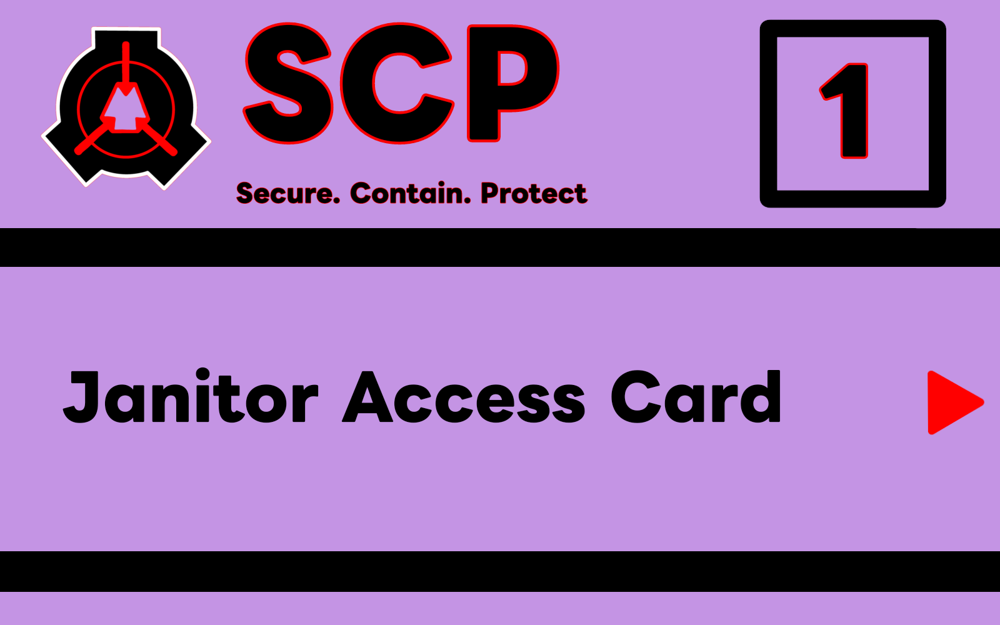  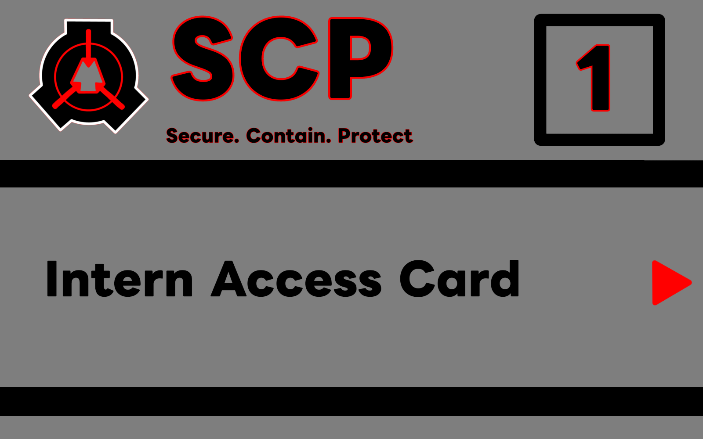 |
| 2 | В зависимости от типа карты:  - Оружейные во входной зоне и на 1 уровне содержания  - Некоторые SCP-объекты | - Карта научного сотрудника  - Карта охранника | 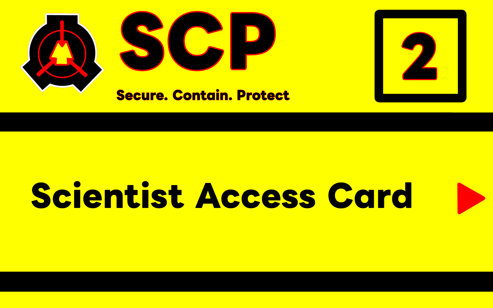  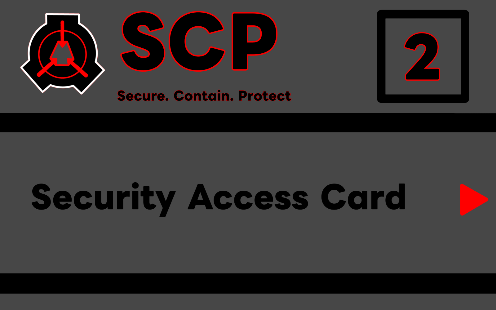 |
| 3 | В зависимости от типа карты:  - Оружейные на 2 уровне содержания  - Большинство SCP-объектов (за исключением отдельных евклидов/кетеров) | - Карта научного руководителя  - Карта сержанта МОГ  - Карта лейтенанта МОГ  - Карта менеджера зоны | 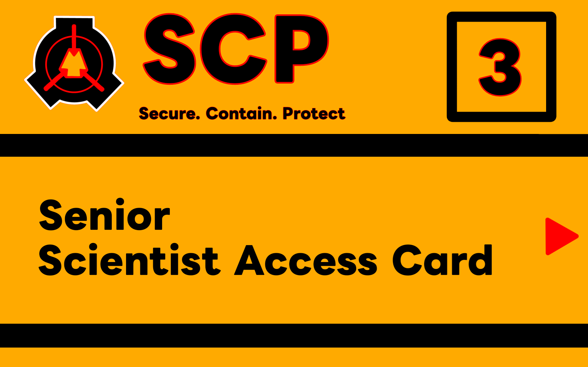  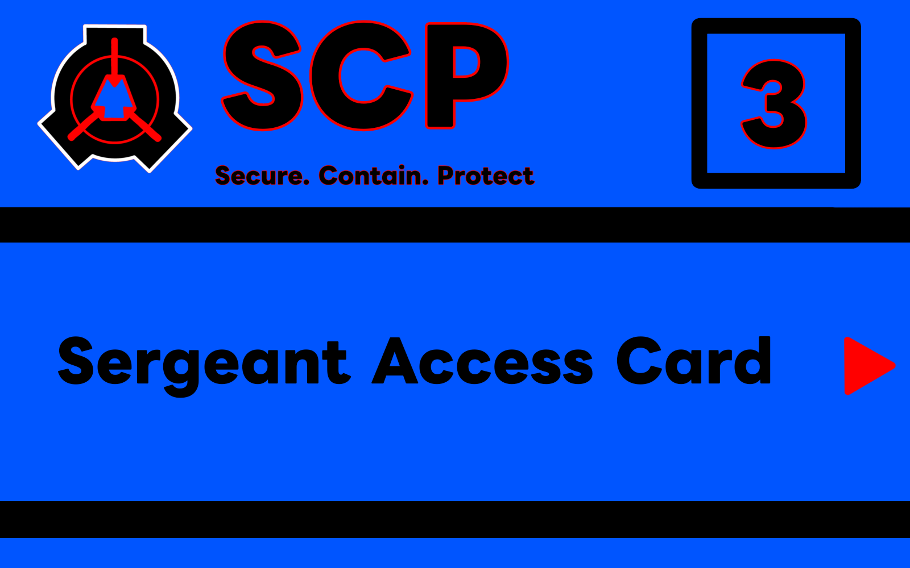  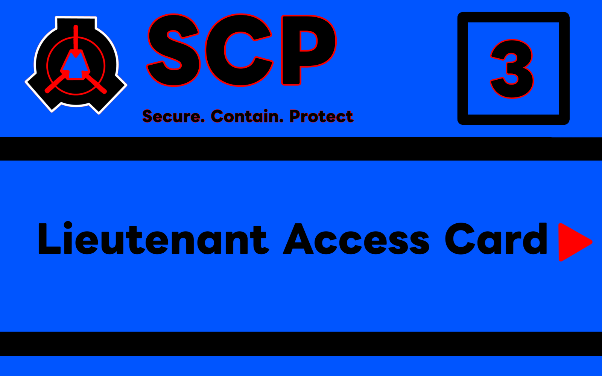  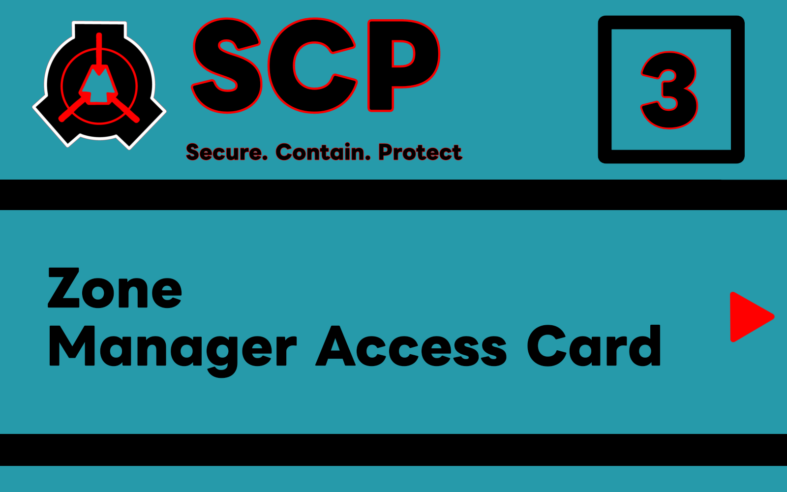 |
| 4 | В зависимости от типа карты:  - Все оружейные  - Все SCP-объекты | - Карта капитана МОГ  - Карта менеджера комплекса  - Устройство Повстанцев Хаоса | 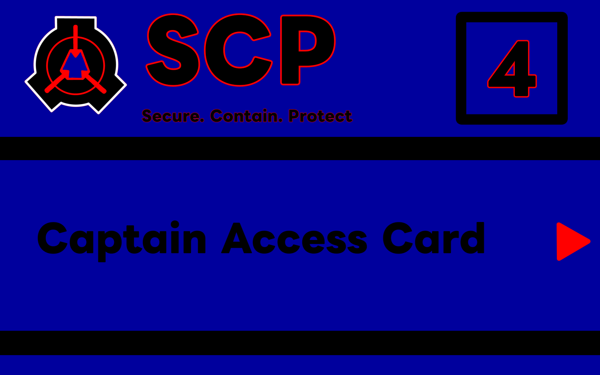  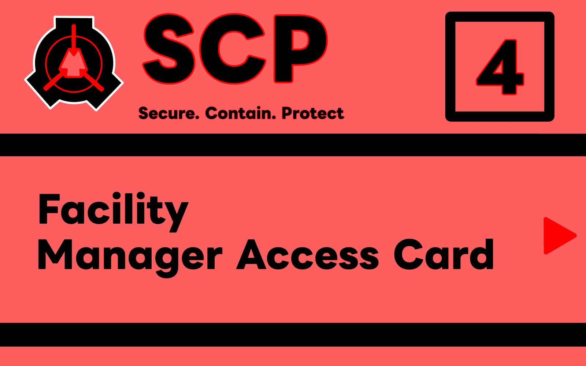  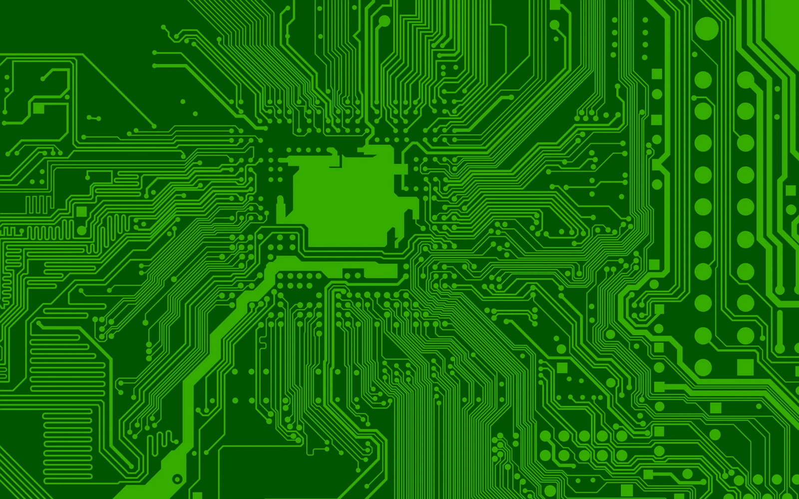 |
| 5 | Полный доступ | - Карта совета O5 | 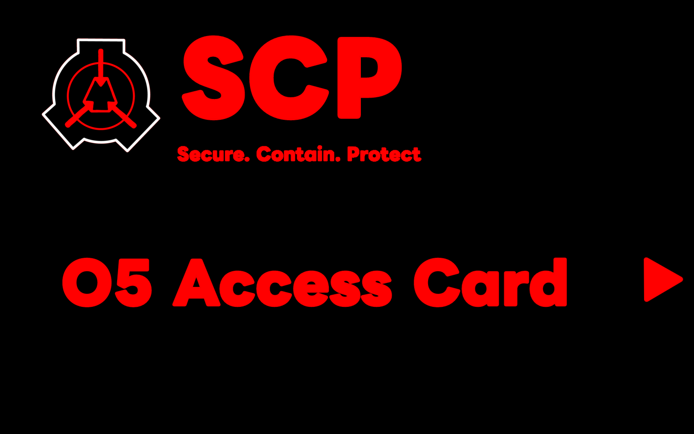 |

### Шаблон модели карт (cards/Blender/cards.blend)

<table>
  <tr>
    <td align="center">
      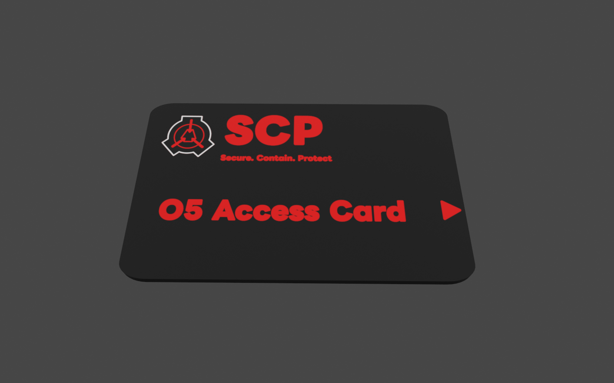
    </td>
    <td align="center">
      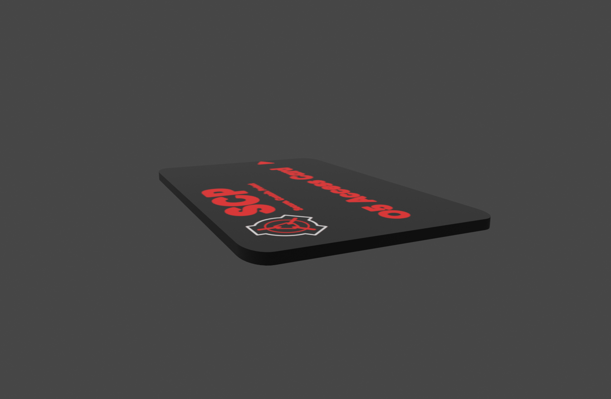
    </td>
  </tr>
</table>

**Размеры модели карты:**

➖ Длина - 176 мм

➖ Ширина - 110 мм

➖  Толщина - 4.7 мм

## 3) Список планируемых SCP-объектов

🟩 Безопасный:

➖ [SCP-500](http://scpfoundation.net/scp-500) - Панацея

➖ [SCP-914](http://scpfoundation.net/scp-914) - Часовой механизм (Машина)

➖ [SCP-294](http://scpfoundation.net/scp-294) - Кофейный автомат

➖ [SCP-261](http://scpfoundation.net/scp-261) - Межпространственный торговый автомат

➖ [SCP-427](http://scpfoundation.net/scp-427) - Лавкрафтовский амулет (Амулет)

➖ [SCP-343](http://scpfoundation.net/scp-343) - "Бог"

➖ [SCP-207](http://scpfoundation.net/scp-207) - "Кока-Кола"

➖ [SCP-268](http://scpfoundation.net/scp-268) - Кепка-невидимка (Кепка)

➖ [SCP-330](http://scpfoundation.net/scp-330) - "Не берите больше двух" (Конфеты)

➖ [SCP-1344](http://scpfoundation.net/scp-1344) - Очки-глазохваты (Очки)

🟨 Евклид:

➖ [SCP-049](http://scpfoundation.net/scp-049) - Чумной доктор

➖ [SCP-079](http://scpfoundation.net/scp-079) - Старый ИИ (Компьютер)

➖ [SCP-096](http://scpfoundation.net/scp-096) - "Скромник"

➖ [SCP-173](http://scpfoundation.net/scp-173) - Скульптура (Печенька)

➖ [SCP-018](http://scpfoundation.net/scp-018) - Мяч "Super Ball" (Мяч)

➖ [SCP-1162-V](http://scpfoundation.net/scp-1162-v) - Дыра в стене

🟥 Кетер:

➖ [SCP-106](http://scpfoundation.net/scp-106) - Старик (Дед)

➖ [SCP-939](http://scpfoundation.net/scp-939) - Со множеством голосов (Собака)

## 4) Список планируемых игровых предметов (не SCP-объекты):

➖ [ШИФРАТОР](https://scpfoundation.net/incident-096-1-a) (рабочая версия проекта доктора Дэна)

➖ Различное оружие и его модификации

➖ Амуниция (бронежилеты различной степени защиты)

➖ Аптечка, адреналин

## 5) Принцип работы некоторых SCP:

### 1) SCP-914:

➖ Улучшение карт:

| Режим SCP-914 | Результат |
|---------------|-----------|
| Очень грубо | - Уничтожает карту (50%) либо понижает её уровень доступа на 1 (50%), для карт 1 уровня доступа - уничтожает карту (100%)  - При понижении уровня доступа сохраняет тип карты (Служба Безопасности/МОГ, учёные) |
| Грубо | Понижает уровень доступа карты на 1 (100%), для карт 1 уровня доступа - уничтожает карту (100%)  - При понижении уровня доступа сохраняет тип карты (Служба Безопасности/МОГ, учёные) |
| 1:1 | - Сохраняет уровень доступа карты, но меняет её тип (100%) |
| Тонко | - Улучшает уровень доступа карты на 1 (100%), для карты совета O5 - сохраняет 5 уровень доступа (100%)  - При повышении уровня доступа сохраняет тип карты (Служба Безопасности/МОГ, учёные) |
| Очень тонко | - Улучшает уровень доступа карты на 1 (40%), улучшает уровень доступа карты на 2 (20%), уничтожает карту (40%), для карт 4 уровня доступа - улучшает уровень доступа карты на 1 (60%), уничтожает карту (40%), для карты совета O5 - уничтожает карту (100%)  - При повышении уровня доступа сохраняет тип карты (Служба Безопасности/МОГ, учёные) |
